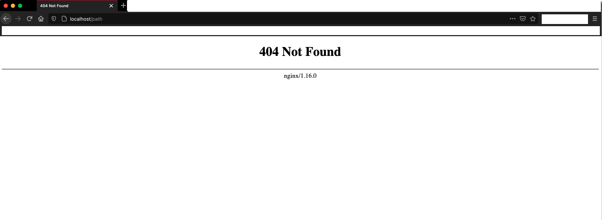
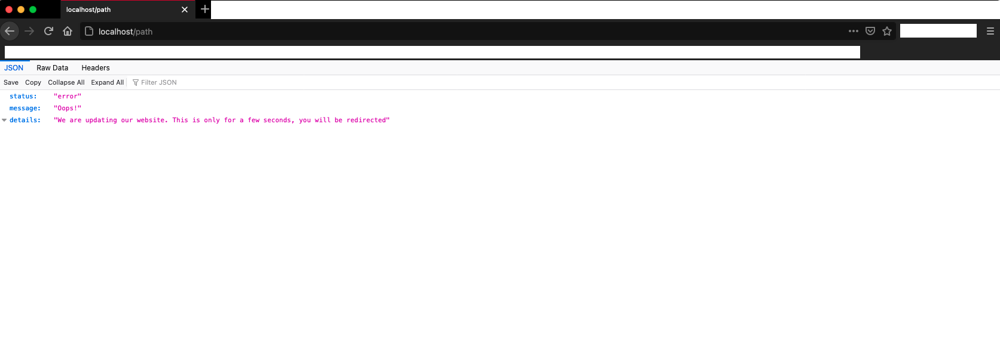

In our microservice, we decided to have all our API response to be in JSON format. This can be easily handled in the responses returned by the APIs from  the web-server. What about the error responses returned by NGINX?.
This is the response from NGINX if the given URL is not found



So how do we change this to our desired JSON format?. It is simple!. We need to make use of the keyword `error_page`. This should be used in 
the `server`, `http` or `location` directive in the `nginx.conf` file. A simple example would be

```lombok.config
error_page 404 /404.json;
location /404.json {
    return 404 '{"status": "error", "message": "Oops!", "details": "We are updating our website. This is only for a few seconds, you will be redirected"}';
}
```

Now our response from NGINX would be



We can either build a common response for all 4XX and 5XX status or give each status a separate response.

#### 1. Common for all

```lombok.config
error_page 400 401 402 403 404 405 406 407 408 409 410 411 412 413 414 415 416 417 418 421 422 423 424 425 426 428 429 431 451 500 501 502 503 504 505 506 507 508 510 511 /error.json;
location /error.json {
    return 200 '{"status": "error", "message": "Oops!", "details": "We are updating our website. This is only for a few seconds, you will be redirected"}';
}
```

#### 2. Each one a separate response

```lombok.config
error_page 404 /404.json;
location /404.json{
    return 200 '{"status": "error", "message": "Oops!", "details": "We are updating our website. This is only for a few seconds, you will be redirected"}';
}

error_page 500 /500.json;
location /500.json{
    return 500 '{"status": "error", "code": "INTERNAL_SERVER_ERROR", "message": "Oops!", "details": {"description": "Internal Server Error"}}';
}

error_page 502 /502.json;
location /502.json{
    return 502 '{"status": "error", "code": "BAD_GATEWAY", "message": "Oops!", "details": {"description": "Bad Gateway"}}';
}

error_page 503 /503.json;
location /503.json{
    return 503 '{"status": "error", "code": "SERVICE_TEMPORARILY_UNAVAILABLE", "message": "Oops!", "details": {"description": "Service Temporarily Unavailable"}}';
}

error_page 504 /504.json;
location /504.json{
    return 504 '{"status": "error", "code": "GATEWAY_TIMEOUT", "message": "Oops!", "details": {"description": "Gateway Timeout"}}';
}
```

### Useful Links
1. [https://nginx.org/en/docs/][1]
2. [https://nginx.org/en/docs/http/ngx_http_core_module.html#error_page][2]

[1]: https://nginx.org/en/docs/
[2]: https://nginx.org/en/docs/http/ngx_http_core_module.html#error_page
