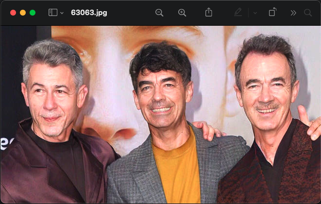
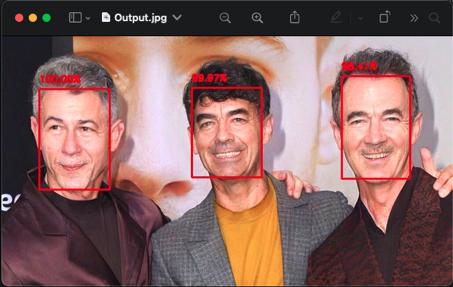

Hello, today we are going to build a simple face detection application using Python and OpenCV. We will be doing this using the `dnn` module from `opencv`.

To build the application we will be in need of the model itself. To build the model we require two files:

1. The [.caffemodel][model] file which contains the model's weights
2. The [text][text] file describing the model's architecture

Once we have the above files, we can start building the application

### Let's get started

The following packages are required to build our document scanner:

```text
imutils
numpy
opencv-python
scikit-image
```

Create a virtual environment and install these packages.

### Getting the Image

We take the input as command-line arguments and as I mentioned previously in my [blog][blog] post, we will be using the `argparse` module.

```python
parser = argparse.ArgumentParser('FaceDetection using Python and OpenCV')
parser.add_argument('-i', '--image', help='Path to the Image file', required=True, type=str)
args = parser.parse_args()
```

### Loading the model

Now we load the model from the .caffemodel and the text file

```python
net = cv2.dnn.readNetFromCaffe('resources/deploy.prototxt.txt', 'resources/res10_300x300_ssd_iter_140000.caffemodel')
```

### Getting the blog from Image and finding the dectections

Next, we read the image and create a blog from the Image. The process of getting the blob from the image is nothing, but a series image processing techniques.
Those techniques involve mean `subtraction`, `scaling` and optional `channel swapping`.

```python
image = cv2.imread(image_path)
(heigth, width) = image.shape[:2]
blob = cv2.dnn.blobFromImage(image=cv2.resize(image, (300, 300)), size=(300, 300), scalefactor=1.0,
                             mean=(104.0, 177.0, 123.0))
```

Now we give the blob as the input to the model and get the detections

```python
net.setInput(blob)
detections = net.forward()
```

### Outlining the result

The `detection` result is four layer matrix in which the second layer contains the `frame`, third layer contains the `number of detections`, and the fourth layer
contains the `class ID`, `class score`, `confidence score`, and the coordinates in the format `x, y, w, h`

We loop through each detection and check its confidence score against a threshold, if the score is greater than the threshold we outline it in the original image.
To outline the face in the image, we extract the coordinates and display a box using those coordinates with the confidence score.

```python
for i in range(0, detections.shape[2]):
    confidence = detections[0, 0, i, 2]
    if confidence > 0.5:
        box = detections[0, 0, i, 3:7] * np.array([w, h, w, h])
        startX, startY, endX, endY = box.astype("int")
        text = "{:.2f}%".format(confidence * 100)
        y = startY - 10 if startY - 10 > 10 else startY + 10
        cv2.rectangle(image, (startX, startY), (endX, endY), (0, 0, 255), 2)
        cv2.putText(image, text, (startX, y), cv2.FONT_HERSHEY_SIMPLEX, 0.45, (0, 0, 255), 2)

cv2.imshow("Output", image)
cv2.waitKey(0)
cv2.destroyAllWindows()
```





Github [code][code]

[model]: https://github.com/bumblebee211196/FaceDetection/blob/main/resources/res10_300x300_ssd_iter_140000.caffemodel
[text]: https://github.com/bumblebee211196/FaceDetection/blob/main/resources/deploy.prototxt.txt
[blog]: https://bumblebee2196.netlify.app/simple-document-scanner/
[code]: https://github.com/bumblebee211196/FaceDetection
