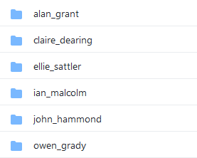
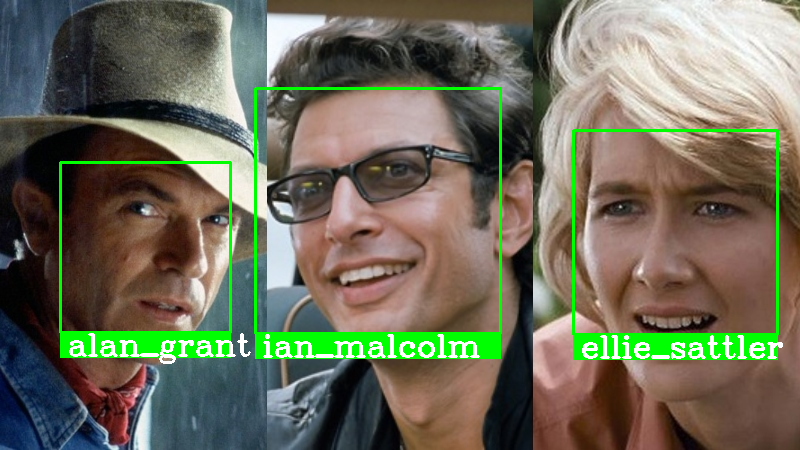

Hello, today we are going to build a simple face-recognition application using python and `opencv`.

## Lets get started

We will be achieving this in 4 steps:
1. Find face(s) in the image
2. Analyze the facial features of the face(s) in the image
3. Compare against known faces
4. Make a prediction

The following packages are required to build our face-recognition application:

```text
numpy
opencv-python
scikit-image
face-recognition
dlib
```

Create a virtual environment and install these packages.

### 1. Finding face(s) in the image

We will be taking the input image as a command-line argument using the `argparse` module. Additionally we take the model type as an argument for getting the face-locations from the image.

```python
parser = argparse.ArgumentParser('FaceRecognition Application - Face recognizer')
parser.add_argument('-i', '--image', help='Path to the Image file', required=True)
parser.add_argument('-m', '--model', help='Face detection method, `hog` or `cnn`. Use `cnn` if GPU is available.', default='hog')
args = vars(parser.parse_args())
```

Since `opencv` processes images in BGR format, we need to convert it to RGB format.

```python
image = cv2.imread(args['image'])
image_rgb = cv2.cvtColor(image, cv2.COLOR_BGR2RGB)
```

Now we find the face(s) in the image using the `face-recognition` package.

```python
locations = face_recognition.face_locations(image_rgb, model=args['model'])
```

### 2. Analyzing the facial features

Analyzing the facial features is nothing getting the salient features about the face(s) from the image. These features include details like gap between the eyebrows, the color and size of the eyes and other measurements of the face.

These values are stored as a 128 bit encodings, which can be used to compare with other faces' encodings to make a predictions

To get the encodings for the face(s) in the image we use the `face_encodings` method from the `face-recognition` package.

```python
encodings = face_recognition.face_encodings(image_rgb, locations)
```

### 3. Comparing the encodings

Before we compare an unknown face's, we need to collect the encodings of the known faces. So that when we compare we can find whose face is it.

Make sure to structure your images with the person's name as the folder name like below. This would be helpful while finding the encodings and storing those encodings across the person's name



```python
RESOURCES = 'resources'

for name in os.listdir(RESOURCES):
    for file in os.listdir(f'{RESOURCES}/{name}'):
        image = cv2.imread(f'{RESOURCES}/{name}/{file}')
        image_rgb = cv2.cvtColor(image, cv2.COLOR_BGR2RGB)

        locations = face_recognition.face_locations(image_rgb, model='cnn')  # Use model="hog" if GPU is not available
        encodings_ = face_recognition.face_encodings(image_rgb, locations)

        for encoding in encodings_:
            encodings.append(encoding)
            names.append(name)

data = {"names": names, "encodings": encodings}
with open(args['output_file'], 'wb') as fp:
    pickle.dump(data, fp)
```

We find the `encodings` from each image and store it in a list with the person's name. At-last, we store the `names` and `encodings` so that we can reuse them instead of re-computing them which is time-consuming process.

Also, I have provided the above code as a separate file, so that encodings can be generated for any dataset, but make sure to maintain the folder structure as mentioned in the above image.

To compare the face encodings, we first load the encodings we saved.

```python
RESOURCES = 'resources'

data = pickle.loads(open(f'{RESOURCES}/encodings', 'rb').read())
known_names, known_encodings = data['names'], data['encodings']
```

Now we compare each unknown encoding with the known encodings

```python
for location, encoding in zip(locations, encodings):
    matches = face_recognition.compare_faces(known_encodings, encoding)
    facedis = face_encodings.face_distance(known_encodings, encoding)
```

`compare_faces` returns an array boolean values which tells us wether unknown face is present in the known faces or not.
`face_distance` returns an array of float values which tell us how close the unknown face is to the known faces. The lower the value the more similar the face is.

### 4. Making Prediction

With the matches and face distance values we now check if any known face is present or not

```python
for location, encoding in zip(locations, encodings):
    matches = face_recognition.compare_faces(known_encodings, encoding)
    facedis = face_encodings.face_distance(known_encodings, encoding)
    match_idx, name = np.argmin(facedis), "Unknown"
    if matches[match_idx]:
        name = known_names[match_idx]
    y1, x2, y2, x1 = location
    cv2.rectangle(image, (x1, y1), (x2, y2), (0, 255, 0), 2)
    cv2.rectangle(image, (x1, y2), (x2, y2 + 25), (0, 255, 0), cv2.FILLED)
    cv2.putText(image, name, (x1 + 5, y2 + 22), cv2.FONT_HERSHEY_COMPLEX, 1, (255, 255, 255), 2)
```

We get the `index` by finding the minimum value in the face distances. With the index we can find the unknown face's name.
Then we outline the face with by drawing a rectangle with the coordinates from the face locations and the display the person's name along with it

```python
cv2.imshow('Output', image)
cv2.waitKey(0)
```

Our input image


Our output



Github [code][code]

[code]: https://github.com/bumblebee211196/FaceRecognition
