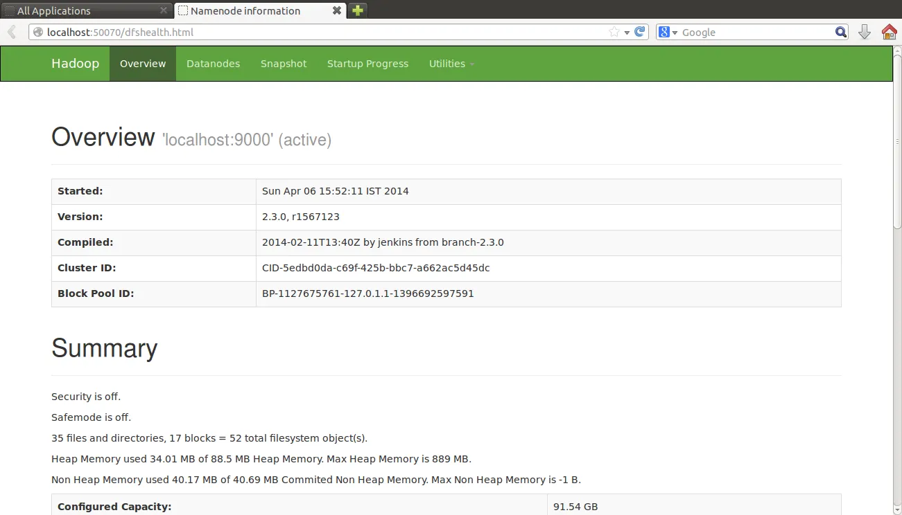
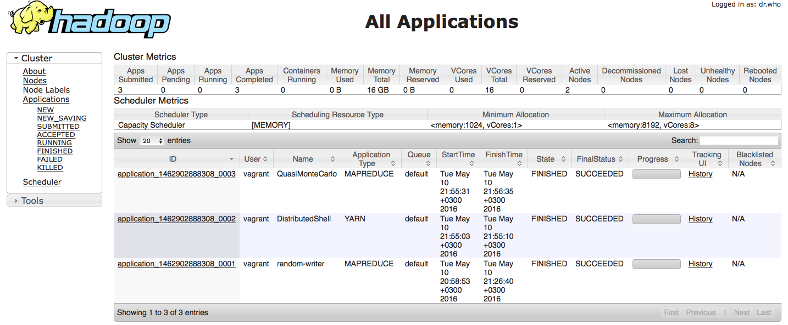

## What is Hadoop?

**Hadoop** is an open source framework for distributed processing and storage for big data applications. It is at the 
center of an ecosystem of big data technologies that are primarily used to support advanced analytics initiatives, 
including predictive analytics, data mining, and machine learning applications. Hadoop can handle various forms of 
structured and unstructured data, giving users more flexibility for collecting, processing and analyzing data than 
relational databases and data warehouses provide.

Hadoop can be set up in three modes:

* **Local(standalone) Mode** - The Standalone mode doesn't really use any of the features of Hadoop. This type of 
configuration is mainly used in debugging. This mode doesn't use HDFS. Instead, it uses the local file system. This 
mode doesn't require any change in the configuration files.
* **Pseudo-Distributed Mode** - In this mode, the Hadoop daemons Namenode and Datanode run on the same machine. It is 
also known as Single Node Cluster. Such a configuration is mainly used while testing when we don’t need to think about 
the resources and other users sharing the resource.In this architecture, a separate JVM is spawned for every Hadoop 
components as they could communicate across network sockets, effectively producing a fully functioning and optimized 
mini-cluster on a single host.
* **Fully-Distributed Mode** - This is the production model of Hadoop.Here data will be distributed across several nodes 
and processing will be done on each node. Master and Slave services will be running on the separate nodes in 
fully-distributed Hadoop Mode.

For further information, please visit the official Hadoop [site](http://hadoop.apache.org/docs/current/ "Hadoop's Homepage").

## Prerequisites for Hadoop Setup

[Java](https://www.oracle.com/technetwork/java/javase/downloads/index.html "Java") must be installed on all the nodes.

## Distribute Authentication Key-pairs for the Hadoop user permalink    

The master node will use a ssh-connection to connect to other nodes with key-pair authentication, to manage the cluster.

First, we should generate a ssh key. In order to do so, we will use the `ssh-keygen` package.

```
ssh-keygen -b 4096
```

Next, copy the key to the slave nodes.

```
ssh-copy-id -i $HOME/.ssh/id_rsa.pub user@node1
ssh-copy-id -i $HOME/.ssh/id_rsa.pub user@node2
ssh-copy-id -i $HOME/.ssh/id_rsa.pub user@node3
```

## Download and unzip Hadoop

You can download the hadoop file [here](https://archive.apache.org/dist/hadoop/core/ "Hadoop download").

Once downloaded, move to the directory where you want to unzip the hadoop tarball and execute the following command.

```
tar -xzvf hadoop-2.9.1.tar.gz
```

## Set the Environment Variables

Add hadoop to your PATH.

```
export HADOOP_HOME=/home/user/hadoop-2.9.1
export PATH=$PATH:$HADOOP_HOME/bin
```

## Configuring the Nodes

#### Set Java

Edit the file hadoop-2.9.1/etc/hadoop/hadoop-env.sh on all nodes.

```
export JAVA_HOME=/home/user/path-to-your-java directory
```

#### Set Namenode location

Edit the file hadoop-2.9.1/etc/hadoop/core-site.xml on all nodes.

```
<configuration>
  <property>
    <name>fs.defaultFS</name>
    <value>hdfs://hostname:8020</value>
  </property>
</configuration>
```

The hostname and the port is where the namenode runs. It also tells the namenode to which hostname and the port it should bind.

#### Set HDFS

Edit the file hadoop-2.9.1/etc/hadoop/hdfs-site.xml on all nodes.

Before configuring the hdfs-site.xml file, create directories namenode and datanode on the Master and Slaves respectively. On the Master, create directory namenode and on the Slave create directory datanode. The namenode is the directory where all the metadata and data related to HDFS will be stored.

One the Master:

```
<configuration>
  <property>
    <name>dfs.namenode.name.dir</name>
    <value>/home/user/hadoop/namenode</value>
  </property>

  <property>
    <name>dfs.replication</name>
    <value>3</value>
  </property>
</configuration>
```

On the Slave:

```
<configuration>
  <property>
    <name>dfs.datanode.data.dir</name>
    <value>/home/user/hadoop/datanode</value>
  </property>

  <property>
    <name>dfs.replication</name>
    <value>3</value>
  </property>
</configuration>
```

The default replication factor is 3. The replication factor should not be more than the number of slaves.

#### Set YARN
     
Edit the file `hadoop-2.9.1/etc/hadoop/mapred-site.xml on all nodes`

```
<configuration>
 <property>
     <name>mapreduce.framework.name</name>
     <value>yarn</value>
 </property>
</configuration>
```

YARN is the runtime framework for running MapReduce jobs.

#### Configure YARN

Edit the file hadoop-2.9.1/etc/hadoop/yarn-site.xml on all nodes.

```
<property>
  <name>yarn.resourcemanafer.address</name>
  <value>hostname:8032</value>
</property>
```

The address of the application's manager interface in the Resource Manager.

```
<property>
  <name>yarn.resourcemanager.scheduler.address</name>
  <value>hostname:8030</value>
</property>
```

The address of the scheduler interface.

```
<property>
  <name>yarn.resourcemanager.resource-tracker.address</name>
  <value>hostname:8031</value>
</property>
<property>
  <name>yarn.nodemanager.aux-services</name>
  <value>mapreduce_shuffle</value>
</property>
```

The valid service name should only contain a-zA-Z0-9_ and can not start with numbers.

```
<property>
  <name>yarn.nodemanager.aux-services.mapreduce_shuffle.class</name>
  <value>org.apache.hadoop.mapred.ShuffleHandler</value>
</property>
```

#### Configure Slaves

Edit the hadoop-2.9.1/etc/hadoop/slaves on the master node.

```
192.0.1.101
192.0.1.102
192.0.1.103
```

**Note:** All the nodes in the cluster must have the same username.

#### Format the Namenode

HDFS needs to be formatted before starting. Format the namenode on the master using the below command.

```
hadoop namenode -format
```

#### Start HDFS

```
hadoop-2.9.1/sbin/start-dfs.sh
```

The above command will start the Namenode and the Secondary Namenode on the Master and the Datanode on the Slave nodes.

Check if the hadoop daemons are running by the following command.

```
jps
```

The above command should output as following on the Master as

```
21842 Jps
21384 NameNode
21421 SecondaryNameNode
```

And on the Slave as

```
21374 Jps
15125 DataNode
```

If the daemons don't start, check out the log files for the errors.

## Monitoring HDFS

You can have an overview of the HDFS with the Hadoop user-friendly web interface.

```
http://hostname:50070
```



## Hadoop Commands

Hadoop supports shell commands.

1. To view the list of files on dfs
   ```
   hadoop fs -ls /
   ```
2. To create a directory
   ```
   hadoop fs -mkdir /directory-name
   ```
   [OR]
   ``` 
   hadoop fs -mkdir -p /path/directory-name
   ```
3. To copy a file from your local file system to dfs
   ```
   hadoop fs -put/-copyFromLocal /localpath /dfs-path
   ```
4. To copy a file from your dfs to local file system
   ```
   hadoop fs -get/-copyToLocal /dfs-path /localpath
   ```

## Start YARN
   
To start YARN, run the below command

```
hadoop-2.9.1/sbin/start-yarn.sh
```

Check if the YARN daemons are running by the following command.

```
jps
```

The above command should output as following on the Master as

```
21842 Jps
21384 NameNode
21421 SecondaryNameNode
1274  ResourceManager
```

On the Slave as

```
21374 Jps
15125 DataNode
14324 NodeManager
```

#### Web Interface

```
http://hostname:8088
```



## More Information

The below links will provide more information regarding the configuration files:

* core-site.xml default properties
* hdfs-site.xml default properties
* mapred-site.xml default properties
* yarn-site.xml default properties

[HDFS Shell Commands](https://hadoop.apache.org/docs/current/hadoop-project-dist/hadoop-common/FileSystemShell.html "HDFS shell commands")
