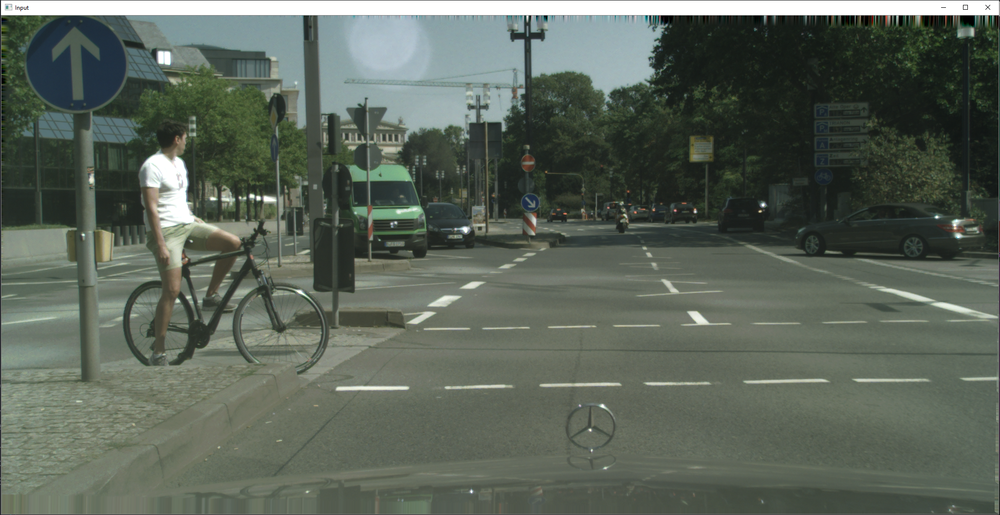
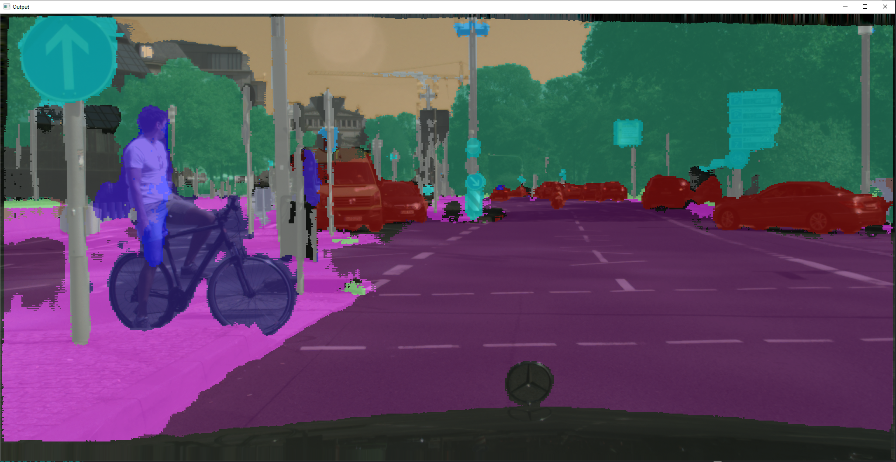
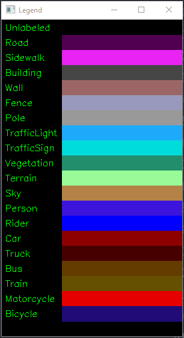

Image segmentation is the process of partitioning an image into multiple segments. The goal of the segmentation is to change the representation of the image to something that is more meaningful.

Semantic segmentation partitions the image into meaningful parts while at the same time, associate every pixel in an input image with a class label. For example person, road, building, etc.

### Let's get started

The following packages are required to build our document scanner:

```text
imutils
numpy
opencv-python
```

Create a virtual environment and install these packages.

We are using the ENet semantic segmentation architecture. We first load the colors and class labels from the respective files.

```python
CLASSES = open('./resources/classes.txt', 'r').read().strip().split('\n')
COLORS = open('./resources/colors.txt', 'r').read().strip().split('\n')
COLORS = [np.array(color.split(',')).astype('int') for color in COLORS]
COLORS = np.array(COLORS, dtype='uint8')
```

For our reference we create a legend, so that it will be easy to identify what part of the image the model has labelled.

```python
legend = np.zeros(((len(CLASSES) * 25) + 25, 300, 4), dtype='uint8')

for (i, (class_name, color)) in enumerate(zip(CLASSES, COLORS)):
    color = [int(c) for c in color]
    cv2.putText(legend, class_name, (5, (i * 25) + 17), cv2.FONT_HERSHEY_SIMPLEX, 0.5, (0, 255, 0), 1)
    cv2.rectangle(legend, (100, (i * 25)), (300, (i * 25) + 25), tuple(color), -1)
```

We now load the model using `opencv's` `dnn` module.

```python
net = cv2.dnn.readNet('./resources/enet-model.net')
```

To make use of the GPU(if any), add the following code.

```python
net.setPreferableBackend(cv2.dnn.DNN_BACKEND_CUDA)
net.setPreferableTarget(cv2.dnn.DNN_TARGET_CUDA)
```

### Image blob

Next we read the image and create a blob from it. The image cannot be provided directly to the model. We provide the blob as input and get the output.

```python
image = cv2.imread(args['image'])
blob = cv2.dnn.blobFromImage(image, 1 / 255.0, (1024, 512), 0, swapRB=True, crop=False)
net.setInput(blob)
output = net.forward()
```

We extract the no of classes, height, width and the color map from the model output

```python
num_classes, height, width = output.shape[1:4]
color_map = np.argmax(output[0], axis=0)
```

From the color map we create a mask, which we overlay over our original image. This will help us to visualize the output of the segmentation. We then display our output with the legend.

```python
mask = COLORS[color_map]
mask = cv2.resize(mask, (image.shape[1], image.shape[0]), interpolation=cv2.INTER_NEAREST)

output = ((0.4 * image) + (0.6 * mask)).astype('uint8')

cv2.imshow('Legend', legend)
cv2.imshow('Output', output)
cv2.waitKey(0)
cv2.destroyAllWindows()
```





Github [code](https://github.com/bumblebee211196/SemanticSegmentation)
