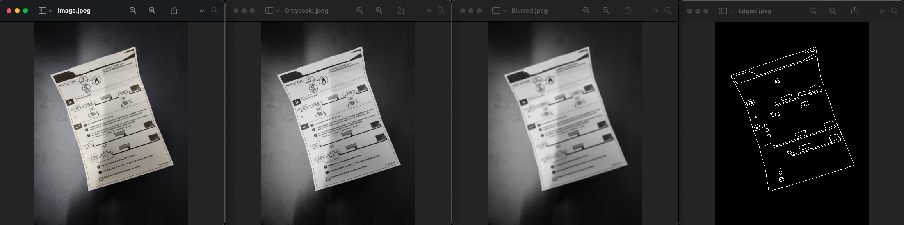
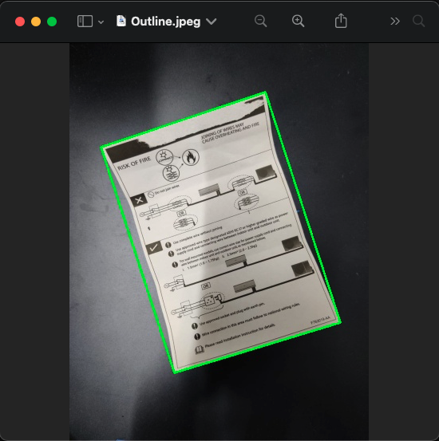
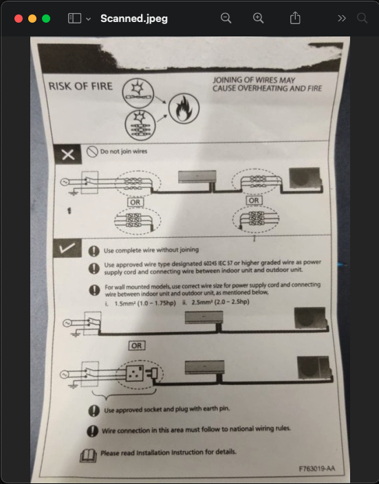

To build a simple document scanner using Python and OpenCV, we need to follow three steps:

1. Scan the document remove any noise from the image and find the edges.
2. Find the document's contour from the image.
3. Get the top view or bird's eye perspective of the image with the calculated boundary points of the document.

### Let's get started

The following packages are required to build our document scanner:

```text
imutils
numpy
opencv-python
scikit-image
```

Create a virtual environment and install these packages.

#### 1. Finding edges

One way of taking the images as input for our program is through command-line argument and this can be achieved by using the [`argparse`][1] module.

```
import argparse

parser = argparse.ArgumentParser()
parser.add_argument('-i', '--image', required=True, type=str, help='Path to the Image')
args = vars(parser.parse_args())

image_path = args['image']
```

The above code will help us get the image as input from the user. Now with the image path, we can read the image using the [`imread`][2] method from `opencv` package.
To find the edges of our document we will use the Canny edge detection algorithm. Before, that we must convert our image to grayscale. That helps in identifying the edges more easily
and remove any noise by smoothening it

```
image = cv2.imread(image_path)
ratio = image.shape[0] / 500.0
orig = image.copy()
image = imutils.resize(image, height=500)
gray = cv2.cvtColor(image, cv2.COLOR_BGR2GRAY)  # Convert image to grayscale
blurred = cv2.GaussianBlur(gray, (5,5), 0)      # Image smoothening for noise removal
edged = cv2.Canny(blurred, 100, 250)            # Edge detection

cv2.imshow('Original', image)
cv2.imshow('Gray', gray)
cv2.imshow('Blurred', blurred)
cv2.imshow('Edged', edged)
cv2.waitKey(0)
cv2.destroyAllWindows()
```



#### 2. Finding contours

Contour is a simple curve joining all the continuous points having same color or intensity.
From the edged image we can find the contours and display it in our original image. While finding contours, we may find contours other than the document itself, and we must make sure correctly identify the document's contour.

```
contours = cv2.findContours(edged.copy(), cv2.RETR_LIST, cv2.CHAIN_APPROX_SIMPLE)
contours = imtutils.grab_contours(contours)
contours = sorted(contours, key=cv2.contourArea, reverse=True)

for contour in contours:
    perimeter = 0.02 * cv2.arcLength(contour, True)
    approx = cv2.approxPolyDP(contour, perimeter, True)
    if len(approx) == 4:
        target = approx
        break

cv2.drawContours(image, [target], -1, (0, 255, 0), 2)
cv2.imshow("Outline", image)
cv2.waitKey(0)
cv2.destroyAllWindows()
```



The `findContours` functions returns a list of contours. We sort the list in reverse order using the `contourArea` function as key. This gives us the contour with the maximum area.
Then from the contours we approximate each contour in a loop for a closed shape. This is done by the [`approxPolyDp`][3] function. We look for shape that is a square or a rectangle, hence we check the length of the approximate shape to be 4.

#### 3. Bird's eye view

Once we get the approximates, we can identify the four corner points of the shape. We write a function to achieve this.

```
def order_points(pts):
    """Order the given set of coordinates as top-left, top-right, bottom-right and bottom-left"""
    rect = np.zeros((4, 2), dtype='float32')
    _sum = np.sum(pts, axis=1)
    rect[0] = pts[np.argmin(_sum)]
    rect[2] = pts[np.argmax(_sum)]
    _diff = np.diff(pts, axis=1)
    rect[1] = pts[np.argmin(_diff)]
    rect[3] = pts[np.argmax(_diff)]
    return rect
```

The logic we get the sum and difference of the points along the axis 1. 
The one with the minimum sum must be the `top-left` and the maximum would be the `bottom-right`.
The one with the minimum difference must be the `top-right` and the maximum would be the `bottom-left`.

Once we get the four points, we can obtain the top-view by using the [`getPerspectiveTransform`][4] method.

```
rect = order_points(pts)
tl, tr, br, bl = rect

width_a = np.sqrt(((tl[0] - tr[0]) ** 2) + ((tl[1] - tr[1]) ** 2))
width_b = np.sqrt(((bl[0] - br[0]) ** 2) + ((bl[1] - br[1]) ** 2))
width = max(int(width_a), int(width_b))

height_a = np.sqrt(((tl[0] - bl[0]) ** 2) + ((tl[1] - bl[1]) ** 2))
height_b = np.sqrt(((tr[0] - br[0]) ** 2) + ((tr[1] - br[1]) ** 2))
height = max(int(height_a), int(height_b))

dest = np.array([
    [0, 0],
    [width-1, 0],
    [width-1, height-1],
    [0, height-1]
], dtype='float32')
mat = cv2.getPerspectiveTransform(rect, dest)
warped = cv2.warpPerspective(image, mat, (width, height))

cv2.imshow("Original", imutils.resize(orig, height=650))
cv2.imshow("Scanned", imutils.resize(warped, height=650))
cv2.waitKey(0)
cv2.destroyAllWindows()
```



Code - [link][https://github.com/bumblebee211196/DocumentScanner]

[1]: https://docs.python.org/3/library/argparse.html
[2]: https://opencv-python-tutroals.readthedocs.io/en/latest/py_tutorials/py_gui/py_image_display/py_image_display.html#read-an-image
[3]: https://opencv-python-tutroals.readthedocs.io/en/latest/py_tutorials/py_imgproc/py_contours/py_contour_features/py_contour_features.html#contour-approximation
[4]: https://opencv-python-tutroals.readthedocs.io/en/latest/py_tutorials/py_imgproc/py_geometric_transformations/py_geometric_transformations.html#perspective-transformation
