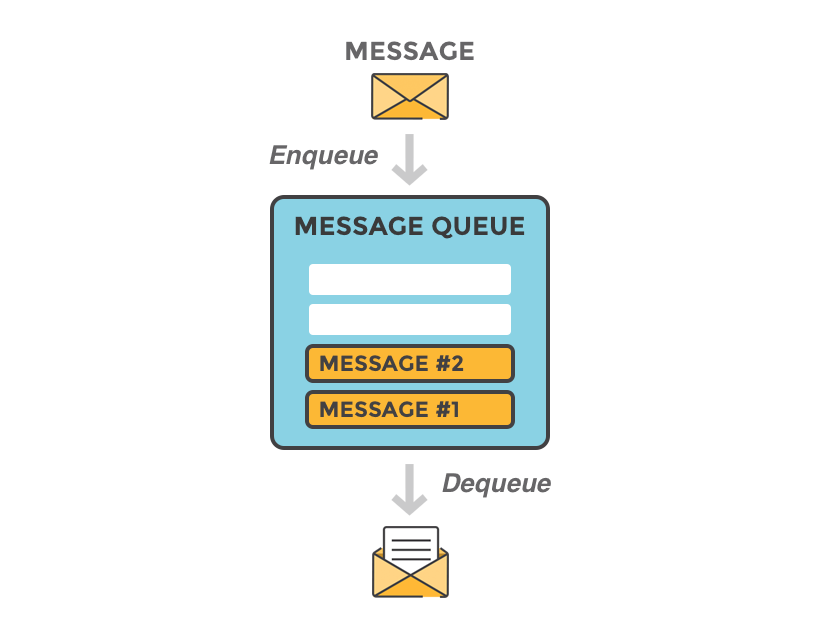
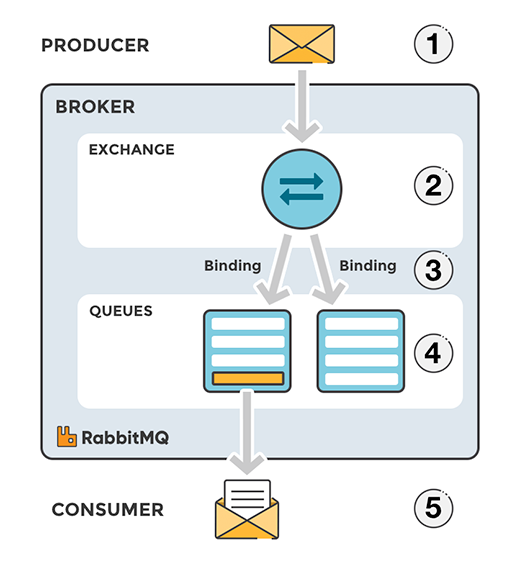
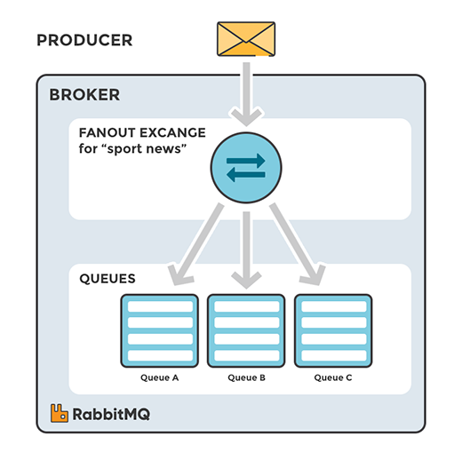
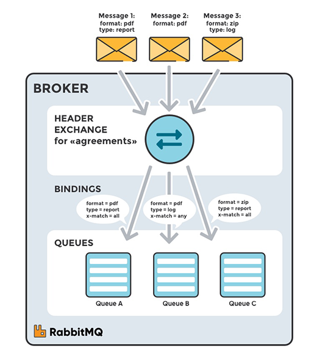

In the recent projects I’ve worked on, we decided to move on the direction of a microservice architecture pattern. The 
motivation behind such a move was to overcome the difficulties faced in the monolith architecture and based on our requirements as well.
RabbitMQ is a component which we heavily depend in our microservice architecture. Let's move on to understand more about RabbitMQ.

## What is RabbitMQ

RabbitMQ is a message-queuing software that is implemented using AMQP(Advanced Message Queuing Protocol). Message queuing 
facilitates effective communication between applications by sending messages. It also serves as a temporary shelter for 
messages by storing them while the destination application is busy or not connected. Message queues enable asynchronous 
communication, which means that other applications (endpoints) that are producing and consuming messages interact with 
the queue, instead of communicating directly with each other.

What is **message**? A message can include any information. It could, for example, contain information about a process/job that should 
start on another application (that could be on another server), or it might as well just be a simple text message. It could 
be a signal to inform an application to start processing a task, or tell an application about the completion of a task by another application. 

#### Architecture of RabbitMQ
* **Publishers** publish messages to the **Queue**.
* The message broker stores the messages until a **Consumer** connects and takes a message off the queue. The consumer 
  then processes the message. 
* Producer and Consumers operate independent of each other.

## AMQP Protocol
The Advanced Message Queuing Protocol(AMQP) is an open standard application layer protocol for message-oriented middleware. 
The defining features of AMQP are message orientation, queuing, routing (including point-to-point and publish-and-subscribe), reliability and security.

AMQP mandates the behaviour of message publisher and message consumer for seamless transportation of messages between 
different applications built by different vendors in different programming languages.

#### Message flow in RabbitMQ

1. The producer publishes a message to an exchange. When you create the exchange, you have to specify the type of it. 
   The different types of exchanges are explained in detail later.
2. The exchange receives the message and is now responsible for the routing of the message. The exchange takes different 
   message attributes into account, such as routing key, depending on the exchange type.
3. Bindings have to be created from the exchange to queues. In this case, we see two bindings to two different queues 
   from the exchange. The Exchange routes the message into the queues depending on message attributes.
4. The messages stay in the queue until they are handled by a consumer
5. The consumer handles the message.

## Components in RabbitMQ

#### Publishers
The term "publisher" means different things in different contexts. In general, in messaging a publisher (also called "producer") 
is an application (or application instance) that publishes (produces) messages. The job of a **Publisher** is to publish 
the given message to the RabbitMQ message broker.

#### Consumers
The term "consumer" means different things in different contexts. In general, in messaging a consumer is an application 
or application instance) that consumes messages. The **Consumer** consumes the message(s) from the queue it is connected to. 
On successful processing of the message, the consumer can acknowledge, and the message will be removed from the queue.

#### Queues
A queue is a place where RabbitMQ stores messages/data. RabbitMQ queues also follow FIFO — First-In-First-Out 
methodology. Queues can be configured queues through available programming libraries. It  can be made durable (with the 
Durability property) to safeguard the data in case the broker crashes. Names can also be provided (with the Name property) 
to a queue. Other than Name and Durability, a queue has a few other properties like auto-delete, exclusive, and arguments.

#### Exchanges
Messages don't get published directly to a queue, instead, the producer sends messages to an exchange. An exchange is 
responsible for the routing of the messages to the different queues. An exchange accepts messages from the producer 
application and routes them to message queues with the help of bindings and routing keys. A binding is a link between 
a queue and an exchange.

#### Types of Exchanges

##### Direct Exchange
When creating a Direct exchange, it will direct the message to the queue that is bound to it. 
Routing Key is an attribute responsible for informing the exchange to which queue the message should be directed.

  
##### Fanout Exchange 
Unlike the Direct type, in the fanout, we don't have the Routing Key figure.
When a Fanout exchange receives a message, a copy of this message is sent to all queues bound to it.

##### Topic Exchange
In the Topic, it is possible to use patterns for routing keys. These patterns can be created using the * and # characters. 
When creating a routing key pattern with #, we are telling the exchange that this # can be **replaced by 0 or n words**. 
When we use *, we are saying for exchange that * can only be **replaced by 1 word**. Therefore, when an exchange of Topic 
type receives a message, it will check the Routing Key of the message, compare with the Routing Keys of the queues and 
send a copy of that message to all queues in which the Routing Keys (message and queue) combine.

##### Headers Exchange
Before explaining this exchange, it is necessary to inform that it is possible to send attributes in the header of a 
message (similar to the header of HTTP). Headers exchange is similar to Topic, but instead of comparing Routing Key, it 
compares the attributes present in the message header with the attributes present in the arguments defined when we bind 
a queue in exchange. It’s possible to create a rule for this validation.

##### Dead Letter Exchange
If no matching queue can be found for the message, the message is silently dropped. RabbitMQ provides an AMQP extension 
known as the "Dead Letter Exchange", which provides the functionality to capture messages that are not deliverable. 